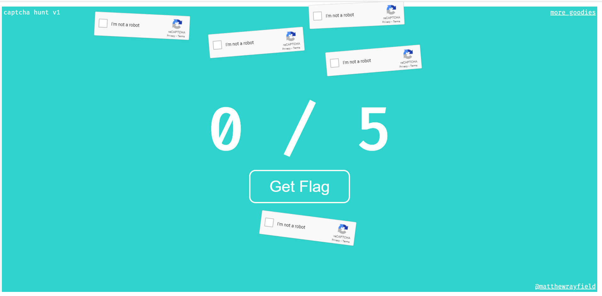

# Hunt

Category: Web

> I couldn't not make this web10
>
> [**http://109.233.57.94:54040/**](http://109.233.57.94:54040/)

The link points to a site with 5 captchas flying around randomly.



Clicking the "Get Flag" button redirects to a `getprize.php?g-recaptcha-response=` page with the message `0 / 5 good ones, too little. Watch out for expires!`

It seems we will need to solve all 5 captchas to get the flag. Let's look at the code on the website.

```js
let count = 0;
let kills = 0;
const total = 5;
let statusBox;
let responses = "";

function updateStatus() {
    statusBox.innerHTML = kills +' / '+ count;
    document.getElementById('g-recaptcha-response').value = responses;

    if (count == total && kills == total) {
        document.getElementById('form').submit();
    }
}

function good(r) {
    kills ++;
    responses += "|" + r;
    updateStatus();
}

var onloadCallback = function() {console.log('load')};

function addCaptcha() {
    const captchaBox = document.createElement('div');
    const widgetId = grecaptcha.render(captchaBox, {
        'sitekey' : '6Ld0sCEUAAAAAKu8flcnUdVb67kCEI_HYKSwXGHN',
        'theme' : 'light',
        'callback': 'good',
    });

    captchaBox.className = 'captcha';
    document.body.appendChild(captchaBox);

    count ++;
    updateStatus();

    let dividerA = (Math.random() * 250) + 250;
    let dividerB = (Math.random() * 250) + 250;
    let dividerC = (Math.random() * 25) + 25;

    function loop() {
        const height = window.innerHeight - captchaBox.offsetHeight;
        captchaBox.style.top = Math.sin(Date.now()/dividerA) * (height/2) + (height/2);

        const width = window.innerWidth - captchaBox.offsetWidth;
        captchaBox.style.left = Math.sin(Date.now()/dividerB) * (width/2) + (width/2);

        captchaBox.style.transform = `rotate(${Math.sin(Date.now()/dividerC) * 10}deg)`;

        setTimeout(loop, 1);
    }
    loop();
}

function addNext() {
    addCaptcha();
    updateStatus();

    if (count < total) {
        setTimeout(addNext, 500);
    }
}

window.addEventListener('load', () => {
    statusBox = document.getElementById('status');
    addNext();
});
```

The `loop` function is responsible for moving the captchas. Unfortunately, as the `loop` function is captured in the `setTimeout(loop, 1)` call, overwriting it after the code is run will have no effect. Using a debugger will be troublesome as the captcha code must be allowed to run. Hence, the best solution is to modify the code before it reaches the browser.

We can use the burp suite interceptor to do so. I removed the `setTimeout(loop, 1)` call from the code. `loop` is called once to spread the captchas out. Afterwards, solving the captchas and getting the flag is straightforward.

Flag: `cybrics{Th0se_c4p7ch4s_c4n_hunter2_my_hunter2ing_hunter2}`